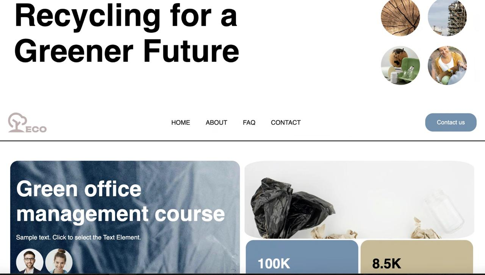

<div align="center">


<h2 align="center">Recycling Today for Tomorrow Website Template Live Demo</h2>


<a href="https://gayane-khachatryan.github.io/Recycling/"><strong>➥ Live Demo</strong></a>

</div>

<br />

### Demo Screeshots



### 📄 Project Description

This is a clean, responsive website template built using custom CSS. The design promotes environmental awareness through a modern, user-friendly layout. Perfect for eco-friendly campaigns, courses, and community initiatives.  
Features include:

- 🌱 Clean and semantic HTML structure
- 📱 Fully responsive design (mobile-first)
- 🎨 Custom CSS styling (no frameworks used)
- 🧼 Lightweight and optimized for performance

---

* [Git](https://git-scm.com/downloads "Download Git") must be installed on your operating system.

### Run Locally

To run **Word Scramble** locally, run this command on your git bash:

Linux and macOS:

```bash
sudo git clone https://github.com/gayane-khachatryan/Recycling.git
```

Windows:

```bash
git clone https://github.com/gayane-khachatryan/Recycling.git
```


### License

This project is **free to use** and does not contains any license.